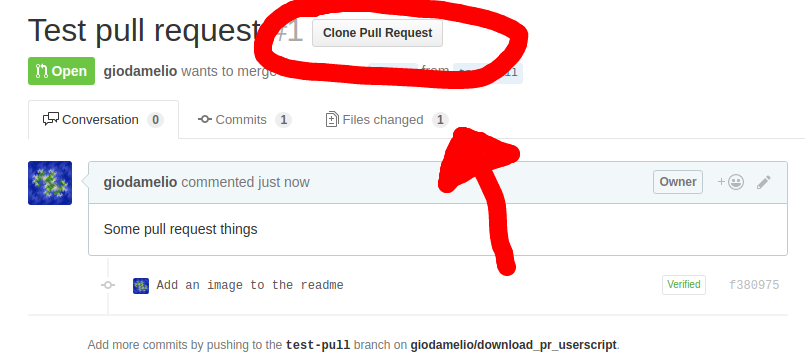

# Download Pull Request Userscript

A quick and dirty userscript that adds a button to github pull requests to allow quick cloning.

## Install

Make sure you have [Tampermonkey](https://chrome.google.com/webstore/detail/tampermonkey/dhdgffkkebhmkfjojejmpbldmpobfkfo?hl=en)(Chrome) or [Greasemonkey](https://addons.mozilla.org/en-US/firefox/addon/greasemonkey/)(Firefox) then [click here](https://github.com/giodamelio/download_pr_userscript/raw/master/download_pr.user.js) to install.
